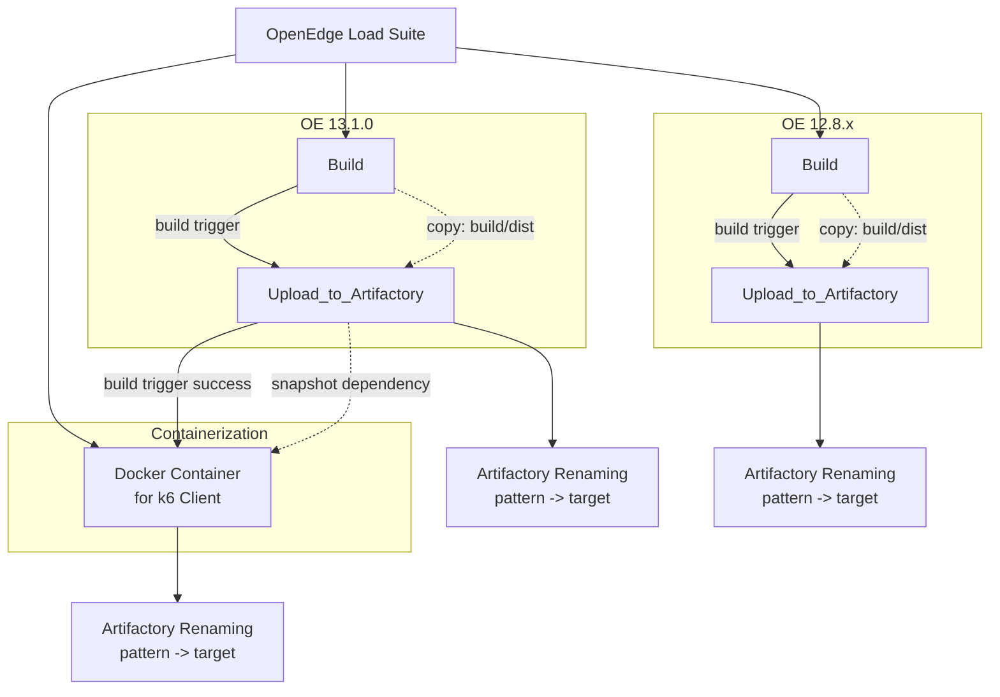

# OpenEdge Load Suite Build Flow

This document describes the [TeamCity project](https://teamcity.bedford.progress.com/project/OpenEdge_DevelopBranchBuilds_OpenEdgeCi_LoadSuite) as users see it in TeamCity and explains how values and artifact names change across build stages.

## TeamCity Project Layout

- OpenEdge Load Suite
    - OE 13.1.0 (release pipeline)
        - Build
        - Upload_to_Artifactory
    - OE 12.8.x (release pipeline)
        - Build
        - Upload_to_Artifactory
    - Containerization (k6 client pipeline)
        - Docker Container for k6 Client

## Parameter Scopes

These are defined once at the project root and inherited unless overridden:

- env.app_api_version = 1.0.0
- ARTIFACTORY_MAVEN_REPO = oe-maven-develop-bedford
- env.dlcType = linuxx86_64
- TOOLNAME = OpenEdge.LoadSuite
- COMPONENT = oels
- env.JAVA_HOME, JAVA_HOME, TC_CHK_PLAT, CURL_EXEC, and related shared values

> Of the above items, `env.app_api_version` is the most likely to change in the future. All artifacts are build using this value and indicates when a significant change to the application API has been introduced which would affect the related k6 tests.

These parameter values change per subproject and drive output naming:

- OE 13.1.0
  - system.build_target_oe_version = 13.1.0
  - system.build_stage = develop
  - env.oe.major.minor.sp.version = 13.1.0
- OE 12.8.x
  - system.build_target_oe_version = 12.8.11
  - system.build_stage = staging
  - env.oe.major.minor.sp.version = 12.8.0

> The `system.build_target_oe_version` value is intended to contain a specific service pack value for the `oeimage` which will be used for compilation, allowing for a highly-targetted build against an OpenEdge release.

## Versioned Release Pipelines

**Build** tasks use the shared build template and performs:

- Gradle build (`gradlew` with no arguments, which runs `defaultTasks`)
- Build log download
- Build log scan and failure checks

> **CI vs. Local Builds:** TeamCity always runs `gradlew` with no arguments. This triggers a full `clean` that wipes `build/DLC` before rebuilding from scratch, ensuring a clean and reproducible CI environment. For local development, use `gradlew local` instead - it runs the same task sequence but uses `cleanBuildOutput` to preserve the `build/DLC` extraction and avoid the expensive re-download on every run. See [DEVELOPER-ABL.md](DEVELOPER-ABL.md) for the full task reference.

**Upload_to_Artifactory** uses the shared upload template and performs:

- Artifact upload via Artifactory uploadSpec
- Build info publication

## Containerization Subproject

Containerization runs Docker packaging for the k6 client in its own subproject.

Execution wiring in current settings:

- Trigger: Docker Container for k6 Client starts on successful completion of OE 13.1.0 Upload_to_Artifactory.
- Snapshot dependency: Docker Container for k6 Client depends on OE 13.1.0 Upload_to_Artifactory (cancel on dependency failure/cancel).

Docker Container for k6 Client performs:

1. Docker environment report and cleanup.
2. Gradle containerize.
3. Upload of k6 container package to Artifactory.

## Artifact Movement

There are two distinct stages:

1. TeamCity artifact copy within build configurations.
2. Artifactory target naming during upload actions.

### Stage 1: TeamCity Copy Rules

**Build** tasks publish artifacts internally first, upon successful execution:

- build/dist => build/dist
- teamcitybuild.log => .

### Stage 2: Artifactory Naming Rules

**Upload_to_Artifactory** uses an Upload Spec to define the source/destination paths:

- Server-Side Installer Package
  - Source File: `build/dist/installer.zip`
  - Target Path: `%ARTIFACTORY_MAVEN_REPO%/%OE_MAVEN_ORG%/%COMPONENT%/%env.app_api_version%/%COMPONENT%-%system.build_target_oe_version%.zip`
    - Example (13.1.0): oe-maven-develop-bedford/com/progress/openedge/oels/1.0.0/oels-13.1.0.zip

- Server-Side Logic Packages
  - Source File: `build/dist/%TOOLNAME%.zip` (eg. `build/dist/OpenEdge.LoadSuite.zip`)
  - Target Path: `%ARTIFACTORY_MAVEN_REPO%/%OE_MAVEN_ORG%/%COMPONENT%/%env.app_api_version%/%TOOLNAME%-%system.build_target_oe_version%-%env.dlcType%.zip`
    - Example (13.1.0): oe-maven-develop-bedford/com/progress/openedge/oels/1.0.0/OpenEdge.LoadSuite-13.1.0-linuxx86_64.zip

- Docker k6 Client Image
  - Source File: `build/dist/k6client-docker-image.zip`
  - Target Path: `%ARTIFACTORY_MAVEN_REPO%/%OE_MAVEN_ORG%/%COMPONENT%/%env.app_api_version%/%COMPONENT%-%env.app_api_version%-k6-client-docker.zip`
    - Example (13.1.0 release train): oe-maven-develop-bedford/com/progress/openedge/oels/1.0.0/oels-1.0.0-k6-client-docker.zip

**Notes:**

- Installer and logic zip files are release-versioned by `system.build_target_oe_version` to reflect the R-code produced.
- Docker images are versioned by `env.app_api_version` and is not tied to system.build_target_oe_version in the current uploadSpec.

## Build Flowchart

