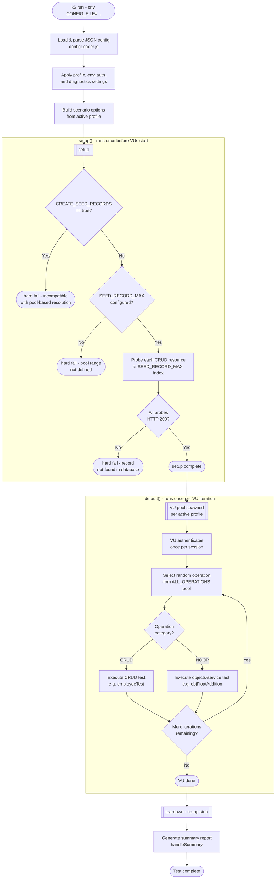

# OpenEdge Load Suite - Grafana k6 Load Testing

This folder contains individual k6 scripts to exercise the RESTful endpoints of the OELS API server:

- Record-driven data tests for CRUD operations in `/data/*`
- ABL primitives tests for `/objects/*` and `/procedures/*`

The root of the folder contains **launchers** which execute groups of the above scripts (tests) in parallel within a single k6 process, placing concurrent load across multiple areas of the load suite.

The goal of the available tests is to provide repeatable scenarios for performing organized requests to a server. The configuration options should allow full flexibility in terms of concurrency, contention, and longevity offering either deterministic (repeatable) tests or wildy-varying throughput tests.

---

## Quick Start: Docker Container

Use of the k6 client Docker image, `oels-<version>-k6-client-docker.zip`, is recommended as is built and published via the CI/CD pipeline from stable project source. This contains the k6 v2.0.0 runtime plus additional tooling in the Linux environment for debugging any potential networking issues. Download the latest package from Progress Artifactory:

```
https://bed-artifactory.bedford.progress.com/artifactory/oe-maven-develop-bedford/com/progress/openedge/oels/<version>/oels-<version>-k6-client-docker.zip
```

> **Note:** For containerized deployment, see `src/main/resources/docker/README.md` for how to load and run the OELS k6 Docker image.

Execution of tests may be run by use of the Bash shell scripts. See "Available Test Launchers" below.

```bash
./launchUnifiedScenario.sh configs/smoke-local.json
```

All test results and output files are automatically saved to a local `logs/<scenario>/<config_name>/<timestamp>/` directory.

> Note: By default all configuration files run with a `BASE_URL` of `http://127.0.0.1:7780` and should be changed to point your intended OpenEdge Load Suite server.

---

## Quick Start: Local k6 Install

Grafana k6 may be installed locally on either Linux or Windows per [their instructions](https://k6.io/get-started/installation/). Execution of the script would be initiated by the appropriate command:

Linux Bash:

```bash
./launchUnifiedScenario.sh configs/smoke-local.json
```

Windows Batch:

```cmd
launchUnifiedScenario.bat configs/smoke-local.json
```

A direct approach would also initiate execution via the k6 binary directly though some common ENV variables will not be set, causing some behaviors to resort to defaults. Use of a launcher script is highly recommended for ease of use.

```bash
k6 run --env CONFIG_FILE=configs/smoke-local.json scripts/launchUnifiedScenario.js
```

See the [Config Files](#config-files) section below for how to select, customize, and create configs.

---

## Available Test Launchers

Shell script wrappers are provided for all launchers, with `launchUnifiedScenario.sh` being the intended scenario as it provides the highest compatibility with the exposed API endpoints. They automatically save results to a `logs/<scenario>/<config_name>/<timestamp>/` directory:

```bash
./launchUnifiedScenario.sh       configs/smoke-local.json
./launchMultiScenario.sh         configs/smoke-local.json
./launchAuthOnly.sh              configs/auth-logout-smoke.json
./launchAnomalies.sh             configs/smoke-local.json
./launchEmployeeHR.sh            configs/smoke-local.json
./launchCustomerSales.sh         configs/smoke-local.json
./launchInventorySupplyChain.sh  configs/smoke-local.json
./launchSystemConfig.sh          configs/smoke-local.json
./launchObjects.sh               configs/smoke-local.json
./launchProcedures.sh            configs/smoke-local.json
```

> While this is a comprehensive list it is not intended that every launcher is intended for load testing. Some may be used to spot-check certain behaviors when appropriate.

---

## Optional Flags

Optional flags available:

| Flag | Description |
|------|-------------|
| `-useDashboard` | Enables the k6 web dashboard and saves a `dashboard.html` report to the run's `logs/` folder. |
| `-useSummary` | Exports the aggregated end-of-test summary to `summary.json` in the run's `logs/` folder. |
| `-includeJsonResults` | Streams all raw metric events to `results.json` in the run's `logs/` folder. Produces very large files — use only when post-processing raw data. |

```bash
# Enable the live dashboard and save a visual HTML report
./launchUnifiedScenario.sh configs/smoke-local.json -useDashboard
```

---

## Understanding k6 Scenarios

Grafana k6 is written in Go (Golang) while all user-facing scripting is written in JavaScript. Testing consists of executing a "scenario" on a "script" which performs an execution lifecycle as a "test" which includes up to 3 phases: a `setup`, a `default` action per VU-iteration, and a `teardown`. Scenarios are used to control the number of virtual users (VUs), iterations, and thresholds for success criteria. These effectively model the workload and traffic pattern intended for use during test executions.

> **Note:** The CRUD scripts utilize the `setup` phase to generate seed records needed for operation of the tests, while the `teardown` is used to delete all generated records to avoid unnecessary database bloating. In the case where a tested table requires dependency records, those child records will be created first as part of the target table's `setup` phase.

### Important execution model notes:

Scenarios are defined as using one of two possible executor models: either iteration-based which executes some number of requests (iterations) against the server using a pool of virtual users (vus); or stage-based which ramps up or down to a target number of virtual users (vus) over a period of time (duration).

> Key point: `iterations` and `stages` are **mutually exclusive** - each executor model uses one or the other, never both.

**Iteration-based executors** (`shared-iterations`, `per-vu-iterations`; used by `smoke`, `simple`, `load`):

- Use `vus` + `iterations` configuration.
- With `shared-iterations`, `iterations` is one shared total, not per VU.
- Example: `vus=5` and `iterations=20` means 20 total iterations split across up to 5 VUs.
- Use `per-vu-iterations` if you need each VU to run a fixed iteration count.

> Key point: Think of this as an open-ended duration which will complete only when a certain number of requests (iterations) have been completed. The bottleneck in this case is the number of virtual users which applies concurrent (parallel) requests against the server.

**Stage-based executors** (`ramping-vus`, `ramping-arrival-rate`; used by `stress`, `chaos`):

- Use `stages` configuration.
- Each stage ramps to a VU count (target) over a time period (duration).
- Example: `{ duration: '2m', target: 25 }` ramps to 25 VUs over 2 minutes.

> Key point: Think of this as a timed test where the total duration of each stage will sum to a specific value. The number of actual requests (iterations) is not enforced but instead runs as many requests as possible by each virtual user until the target and duration are both met.

### Unified Scenario Execution Flow

The `launchUnifiedScenario.js` launcher is the recommended entry point for full mixed-workload testing. The flowchart below illustrates how a single test run progresses from config loading through VU execution to teardown.



> **Pool-based dispatch:** All 17 CRUD resources and 18 NOOP operations are loaded at startup. Each VU selects one at random per iteration, providing an even mixed-workload distribution without single-table saturation.

---

## Config Files

All test settings are configured through a JSON config file. The only command-line setting needed for a normal test run is:

```bat
k6 run --env CONFIG_FILE=configs/<name>.json scripts/launchXxx.js
```

Direct `--env` flags for test settings (`PROFILE`, `MAX_VUS`, `BASE_URL`, etc.) are no longer supported. They must be placed inside the JSON config file.

> **No-config fallback:** If `CONFIG_FILE` is omitted, the launcher falls back to safe smoke defaults (1 VU, 1 iteration) and prints a visible warning. This is a safety net, not the recommended invocation.

### Choose a Starter Config

| Goal | Config |
|------|--------|
| Quick smoke check | `configs/smoke-local.json` |
| Baseline load test | `configs/load-baseline.json` |
| Capacity stress test (100 VUs / 60 min) | `configs/stress-capacity.json` |
| 60-minute chaos run | `configs/chaos-60m.json` |
| Smoke with per-iteration logout | `configs/auth-logout-smoke.json` |
| Smoke with auth debug + diagnostics | `configs/auth-debug-smoke.json` |

Canonical single-profile reference configs are also available in `configs/profiles/` (`smoke.json`, `simple.json`, `load.json`, `stress.json`, `chaos.json`). Do not edit these directly - they are the reference baseline. Extend them instead.

### Running a Test

```bat
rem Quick sanity check
k6 run --env CONFIG_FILE=configs/smoke-local.json scripts/launchEmployeeHR.js

rem Baseline load run
k6 run --env CONFIG_FILE=configs/load-baseline.json scripts/launchUnifiedScenario.js

rem Capacity stress run
k6 run --env CONFIG_FILE=configs/stress-capacity.json scripts/launchObjects.js
```

### Changing the Target URL

Set `env.BASE_URL` in the config file. The easiest approach is a small custom config that extends a canonical profile:

```json
{
  "meta": { "name": "smoke-staging", "description": "Smoke against staging" },
  "extends": "configs/profiles/smoke.json",
  "run":  { "profile": "smoke" },
  "env":  { "BASE_URL": "http://HOST:PORT" }
}
```

```bat
k6 run --env CONFIG_FILE=configs/smoke-staging.json scripts/launchUnifiedScenario.js
```

> Paths in `extends` are resolved relative to the k6 working directory (the directory where the launcher script lives).

### Creating a Custom Config

Copy a starter config or write one from scratch. Fields in `env` must use JSON types - numbers without quotes (`40`, not `"40"`), booleans without quotes (`true`, not `"true"`). The config loader validates all types and throws a descriptive error before any traffic starts.

Minimal custom config:

```json
{
  "meta": { "name": "load-staging-40vu", "description": "Load test against staging, 40 VUs" },
  "extends": "configs/profiles/load.json",
  "run": { "profile": "load" },
  "env": {
    "BASE_URL": "http://HOST:PORT",
    "MAX_VUS": 40,
    "MAX_ITERATIONS": 200
  }
}
```

See [CONFIG_RUNNER.md](CONFIG_RUNNER.md) for the full config schema reference.

### Migrating from `--env` Flags

```bat
rem Old (no longer supported):
k6 run --env PROFILE=load --env MAX_VUS=40 --env BASE_URL=http://HOST:PORT scripts/launchUnifiedScenario.js

rem New:
k6 run --env CONFIG_FILE=configs/load-baseline.json scripts/launchUnifiedScenario.js
```

See [MIGRATION.md](MIGRATION.md) for a complete mapping of every legacy flag to its config file equivalent.

---

## Execution Profiles

A profile selects the execution model - VU count, duration, stage shape, and quality-gate thresholds. Set it via `run.profile` in the config file.

| Profile | Executor | VUs | Iterations / Stages |
|---------|----------|-----|---------------------|
| `simple` | shared-iterations | `MAX_VUS` | `MAX_ITERATIONS` total |
| `smoke`  | shared-iterations | 1 | 1 total |
| `load`   | shared-iterations | `MAX_VUS` | `MAX_ITERATIONS` total shared |
| `stress` | ramping-vus | 0→`MAX_VUS`→0 | Stage-based ramp to peak (`MAX_VUS`), then cooldown |
| `chaos`  | ramping-vus | Random 0–`MAX_VUS` | `DURATION` random 1-minute stages |

### Config Fields by Profile

All fields below go inside the `"env"` object of your config file.

**Auth session behavior** (all profiles):

- **Sticky sessions (default, `AUTH_STICKY_SESSIONS: true`)**: Each VU logs in once and reuses the session across iterations via cookie persistence - realistic user behavior with minimal auth overhead.
- **Non-sticky sessions (`AUTH_STICKY_SESSIONS: false`)**: k6 resets cookies between iterations, forcing re-authentication per iteration. Use only when stress-testing the auth system specifically.
- **Per-iteration logout (`AUTH_LOGOUT_EACH_ITERATION: true`)**: Logs out and clears the session cookie after every iteration even in sticky mode. Use when you need fresh login flows.
- **Forced session invalidation (`AUTH_SESSION_DURATION_SECONDS: <n>`)**: When set to a positive integer, each VU's session is given a finite lifetime of `n` seconds. Once that threshold is crossed, the VU runs the full invalidation cycle (ABL context invalidate → session check → Tomcat logout) in place of the current iteration's scenario work, then re-authenticates on the following iteration. This fires mid-test during long-running `stress` and `chaos` runs and is the primary mechanism for exercising re-authentication under load. Default is `0` (disabled).

**Common fields (all profiles):**

| Field | Default | Description |
|-------|---------|-------------|
| `BASE_URL` | `http://127.0.0.1:7780` | Target server for API calls |
| `MAX_VUS` | `20` | Maximum concurrent Virtual Users |
| `CREATE_SEED_RECORDS` | `false` | Whether to create seed records on-the-fly at runtime (default: use database records). |
| `SEED_RECORD_MAX` | `100000` | Number of records to expect per table on the database when `CREATE_SEED_RECORDS` is `false`. |
| `SEED_RECORD_RATIO` | `1` | VU-to-record ratio for CRUD. `1` = one record per VU; `2` = 2 VUs per record (higher contention). |
| `AUTH_REQUIRED` | `true` | Require per-VU authentication before request execution |
| `AUTH_USERNAME_PREFIX` | `oels-vu` | Per-VU username prefix (format: `<prefix>-<VU_ID>`) |
| `AUTH_PASSWORD` | `password` | Password used for all VU logins |
| `AUTH_CONTEXT_PATH` | `/loadsuite/static/auth` | Webapp context path for auth endpoints |
| `AUTH_LOGIN_ENDPOINT` | _(derived)_ | Login endpoint override |
| `AUTH_LOGOUT_ENDPOINT` | _(derived)_ | Logout endpoint override |
| `AUTH_LOGOUT_EACH_ITERATION` | `false` | Log out and clear session after each iteration |
| `AUTH_STICKY_SESSIONS` | `true` | Preserve session cookies across iterations |
| `AUTH_DEBUG` | `false` | Emit `[auth]` debug logs for every login/logout/session event |

> **`SEED_RECORD_RATIO`**: record pool = `round(MAX_VUS / ratio)` + 20% buffer. Smoke and simple profiles always seed exactly 1 record regardless of this setting.

> **Server-side pre-seeding required:** The unified scenario launcher does **not** create database records at runtime (`CREATE_SEED_RECORDS` defaults to `false`). All CRUD tables must be pre-populated on the server before a test run. The minimum recommended population is **100,000 records per table** - the default value of `SEED_RECORD_MAX`. The `setup()` phase probes each table at the configured maximum index and hard-fails if any record is missing, so an under-populated database is caught before any VUs are spawned. Adjust `SEED_RECORD_MAX` downward only if the target database has fewer records, understanding that this reduces the randomness of the CRUD pool and increases record contention under high concurrency.

**`simple` and `smoke` profiles** - sanity checks, minimal load:

> `MAX_VUS`, `MAX_ITERATIONS`, `DURATION`, and `SEED_RECORD_RATIO` are ignored (always 1 VU, 1 iteration).

**`load` profile** - baseline steady load:

| Field | Default | Behavior |
|-------|---------|----------|
| `MAX_VUS` | `20` | Number of concurrent VUs for entire load run |
| `MAX_ITERATIONS` | `100` | Total iterations shared across all VUs |
| `MIN_THINK_TIME` | `0.1` | Fixed think-time pause (seconds) between requests |

**`stress` profile** - ramp-up to high load:

| Field | Default | Behavior |
|-------|---------|----------|
| `MAX_VUS` | `20` | Peak VU target (ramped through 25%, 50%, 75%, 100%, then cooldown) |
| `DURATION` | `10` | Total test duration in minutes. 4 active stages get `DURATION÷5` minutes each; cooldown gets the remainder. |
| `MIN_THINK_TIME` | `0.1` | Fixed think-time pause (seconds) |

**`chaos` profile** - random load with variable think time:

| Field | Default | Behavior |
|-------|---------|----------|
| `MAX_VUS` | `20` | Upper bound for random VU targets per stage |
| `DURATION` | `10` | Total duration in minutes of random stages |
| `MIN_THINK_TIME` | `0.1` | Lower bound for random think time (seconds) |
| `MAX_THINK_TIME` | `1.0` | Upper bound for random think time; actual value chosen randomly in [`MIN`, `MAX`] |
| `IDLE_STAGE_CHANCE` | `0.05` | Probability (0.0–1.0) that a random stage ramps to 0 VUs, simulating idle periods |

**Multi-scenario launchers** (`launchEmployeeHR`, `launchCustomerSales`, `launchMultiScenario`, etc.):

| Field | Default | Behavior |
|-------|---------|----------|
| `SCENARIO_STAGGER_SECONDS` | `0.5` | Seconds between each scenario's start - spreads the auth spike across time |
| `MAX_VUS` | `20` | Per-scenario VU ceiling; total concurrency = `MAX_VUS × scenario count`. Size carefully. |

### Examples

These are the direct calls to the k6 runtime which utilize the launcher scripts and config file approach.

```bat
rem Smoke test - 1 VU, 1 iteration
k6 run --env CONFIG_FILE=configs/smoke-local.json scripts/launchEmployeeHR.js

rem Baseline load test - 20 VUs, 100 iterations
k6 run --env CONFIG_FILE=configs/load-baseline.json scripts/launchEmployeeHR.js

rem Capacity stress test - 100 VUs, 60 min
k6 run --env CONFIG_FILE=configs/stress-capacity.json scripts/launchEmployeeHR.js

rem Chaos test - 60 min of random VU stages
k6 run --env CONFIG_FILE=configs/chaos-60m.json scripts/launchUnifiedScenario.js

rem Custom run - create a config that extends a profile and overrides only what changes
k6 run --env CONFIG_FILE=configs/my-load-40vu.json scripts/launchUnifiedScenario.js
```

---

See [SCRIPTS.md](SCRIPTS.md) for more information about the available test scripts.

See [OUTPUT.md](OUTPUT.md) for more information about routing results and debugs.

See [MULTI_SCENARIO.md](MULTI_SCENARIO.md) for an explanation of the combined testing scripts.

See [CONFIG_RUNNER.md](CONFIG_RUNNER.md) for the full config file schema reference.

See [MIGRATION.md](MIGRATION.md) for mapping legacy `--env` flags to config file equivalents.