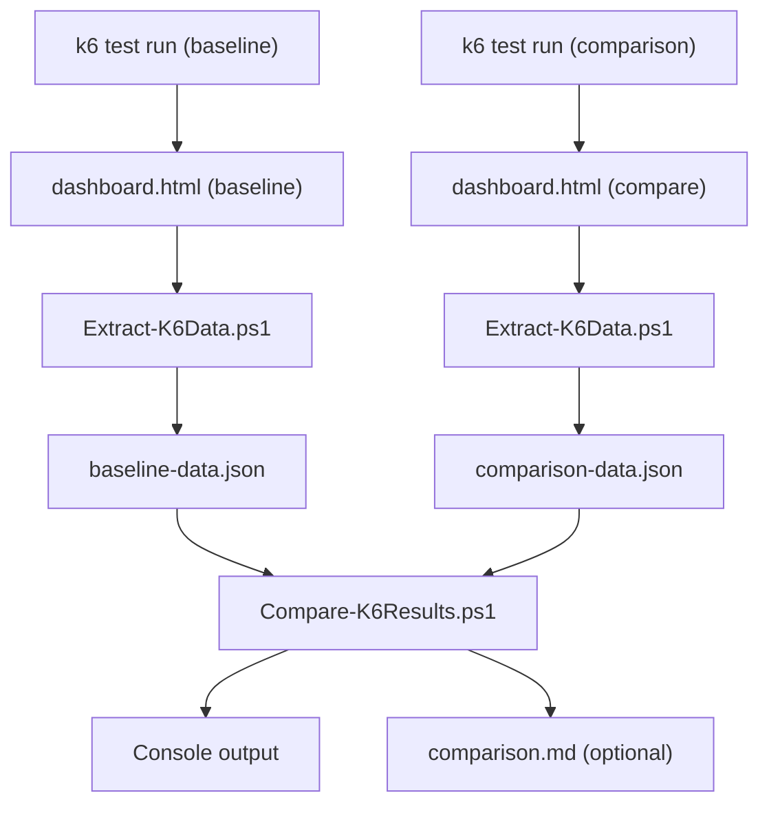

# PowerShell Utility Scripts

This folder contains PowerShell scripts for analyzing k6 load test results and PASOE agent logs.

---

## Scripts

### Extract-K6Data.ps1

Extracts embedded JSON data from a Grafana k6 dashboard HTML report.

k6 HTML dashboards contain base64-encoded, gzipped JSON (NDJSON) data embedded in a `<script id="data">` tag. This script decodes and decompresses that data into a raw `dashboard-data.json` file suitable for use with `Compare-K6Results.ps1`.

**Parameters**

| Parameter | Required | Description |
|-----------|----------|-------------|
| `-HtmlPath` | Yes | Path to the k6 dashboard HTML file |
| `-OutputPath` | No | Output path for the JSON file. Defaults to `[basename]-data.json` in the same folder as the HTML file |

**Examples**

```powershell
# Auto-saves to dashboard-data.json in same folder
.\Extract-K6Data.ps1 -HtmlPath "dashboard.html"

# Save to a specific path
.\Extract-K6Data.ps1 -HtmlPath "dashboard.html" -OutputPath "data.json"
```

---

### Compare-K6Results.ps1

Compares two k6 `dashboard-data.json` files to analyze performance differences between test runs.

Parses time-series snapshot data from both files and produces a side-by-side comparison of HTTP request duration (avg, P90, P95, P99, max), TTFB (waiting time), iteration duration, request rate, and virtual user counts. Optionally exports the comparison as a Markdown report.

> **Note:** Input files must be extracted first using `Extract-K6Data.ps1`.

**Parameters**

| Parameter | Required | Description |
|-----------|----------|-------------|
| `-BaselineFile` | Yes | Path to the baseline `dashboard-data.json` file |
| `-ComparisonFile` | Yes | Path to the comparison `dashboard-data.json` file |
| `-OutputReport` | No | Path to save the comparison as a Markdown file |

**Examples**

```powershell
# Positional parameters
.\Compare-K6Results.ps1 "test_a\dashboard-data.json" "test_b\dashboard-data.json"

# Named parameters with optional report output
.\Compare-K6Results.ps1 -BaselineFile "test_a-data.json" -ComparisonFile "test_b-data.json" -OutputReport "comparison.md"
```

---

### Generate-SessionTimeline.ps1

Generates a Markdown timeline table showing when ABL Sessions (worker threads) were spawned for each PASOE agent process.

Parses a PASOE agent log file (e.g., `<ablapp>.agent.<date>.log`) to find session spawn and completion events. Auto-detects agent PIDs from the log, filters out auxiliary threads, calculates startup duration per session, and writes a table where rows are timestamps and columns are agent PIDs.

**Parameters**

| Parameter | Required | Description |
|-----------|----------|-------------|
| `-LogFilePath` | Yes | Path to the PASOE agent log file |
| `-OutputPath` | No | Output path for the Markdown table. Defaults to `SessionTimeline.md` in the same folder as the log file |

**Examples**

```powershell
# Auto-saves to SessionTimeline.md in the same folder as the log
.\Generate-SessionTimeline.ps1 -LogFilePath ".\myapp.agent.2026-07-29.log"

# Save to a specific path
.\Generate-SessionTimeline.ps1 -LogFilePath ".\myapp.agent.2026-07-29.log" -OutputPath ".\MyTimeline.md"
```

---

## Typical Workflow


